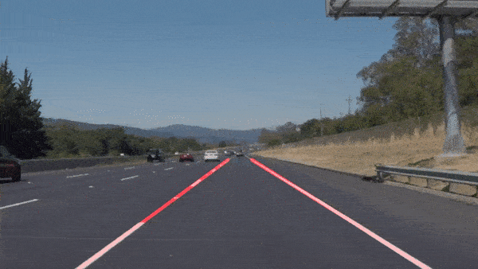

# Udacity_Self_Driving_Project_1

## As a suggestion, the README.md file for each repository can include the following information:
### a list of files contained in the repository with a brief description of each file
1. test_images_output (A directory containing generated lanes-proposed images)
2. test_videos_output (A directory containing generated lanes-proposed videos)
3. P1.html (Generated HTML format for review)
4. P1.ipynb (Source code)
5. README.md (Readme file)
6. writeup.md (Writeup file)
 
### any instructions someone might need for running your code
1. Create subdirectory "test_images_output"
2. Create subdirectory "test_videos_output"

### an overview of the project
When we drive, we use our eyes to decide where to go.  The lines on the road that show us where the lanes are act as our constant reference for where to steer the vehicle.  Naturally, one of the first things we would like to do in developing a self-driving car is to automatically detect lane lines using an algorithm.

In this project you will detect lane lines in images using Python and OpenCV.  OpenCV means "Open-Source Computer Vision", which is a package that has many useful tools for analyzing images.  

To complete the project, two files will be submitted: a file containing project code and a file containing a brief write up explaining your solution. We have included template files to be used both for the [code](https://github.com/udacity/CarND-LaneLines-P1/blob/master/P1.ipynb) and the [writeup](https://github.com/udacity/CarND-LaneLines-P1/blob/master/writeup_template.md).The code file is called P1.ipynb and the writeup template is writeup_template.md 

To meet specifications in the project, take a look at the requirements in the [project rubric](https://review.udacity.com/#!/rubrics/322/view)

## Videos
Video recordings for success cases.  
Success to plot lane lines on solid white right video.  
  
Success to plot lane lines on solid yellow left video.  
  
